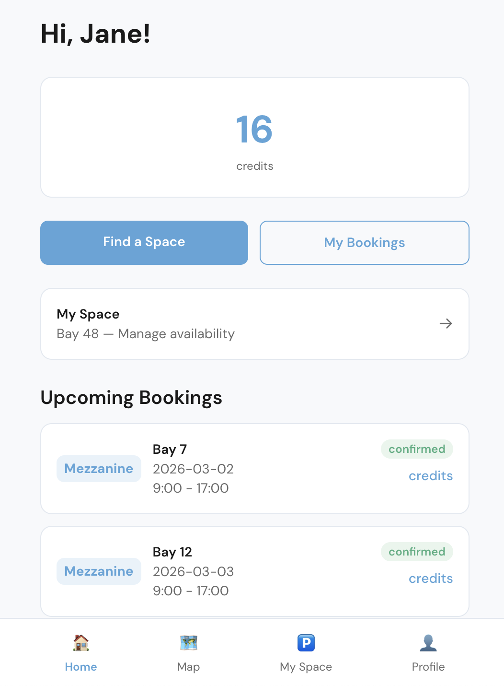

# OneSpot

A community-built parking space sharing app for residents of One Maidenhead, a ~250-unit residential building with limited parking.

<p align="center">
  
</p>

## What it does

Many residents own a parking bay but don't use it every day. OneSpot lets them share that unused time with neighbours who need a space.

- **Bay owners** set a weekly schedule for when their space is free (e.g. weekdays 9-5 while at work)
- **Any resident** can browse available spaces on a given day and book one in a few taps
- A **credit system** keeps things fair: you spend 1 credit per hour of parking, and earn credits back when someone parks in your bay
- **Email notifications** confirm bookings and send reminders before your time runs out
- An **interactive parking map** shows real-time availability across both floors (ground and mezzanine)

No money changes hands. No app store download required -- it's a mobile-friendly web app.

> **Disclaimer:** OneSpot is an independent community tool built by a resident to help neighbours share parking spaces. It is not affiliated with, endorsed by, or operated by Get Living, Greystar, or One Maidenhead management. Use at your own discretion.

---

## Technical Details

### Quick Start

### Backend

```bash
python3 -m venv venv
source venv/bin/activate
pip install -r requirements.txt
uvicorn backend.main:app --reload --port 8000
```

### Frontend

```bash
cd frontend
npm install
npm run dev
```

The frontend dev server runs at `http://localhost:5173` and proxies API requests to the backend at `http://localhost:8000`.

---

### Testing

```bash
# Backend tests
pytest -v

# Frontend tests
cd frontend && npm test
```

---

### Documentation

- [Setup Guide](docs/SETUP.md) -- Resend email API, Railway deployment, environment variables
- [Architecture](docs/ARCHITECTURE.md) -- System overview, request flow, design decisions
- [Development](docs/DEVELOPMENT.md) -- Local dev workflow, testing, common commands

### API

- [API Reference](docs/api/endpoints.md) -- Full endpoint documentation with request/response examples

### Features

- [Authentication](docs/features/auth.md) -- Email OTP login and session management
- [Availability](docs/features/availability.md) -- Owner availability declaration (recurring and one-off)
- [Booking](docs/features/booking.md) -- Credit-based booking with extend, reduce, cancel
- [Map](docs/features/map.md) -- Interactive schematic parking map
- [Admin](docs/features/admin.md) -- Admin API and CLI tools

### Specification

- [Full Specification](onespot-spec.md) -- Complete technical specification (v1.0)

---

### Tech Stack

| Layer | Technology |
|-------|-----------|
| Backend | Python 3.11+, FastAPI |
| Frontend | React 18, Vite, Tailwind CSS |
| State | Single JSON file with file locking |
| Auth | Email OTP, HTTP-only session cookies |
| Hosting | Railway (single service + persistent volume) |

---

## License

Private project. Not for redistribution.
